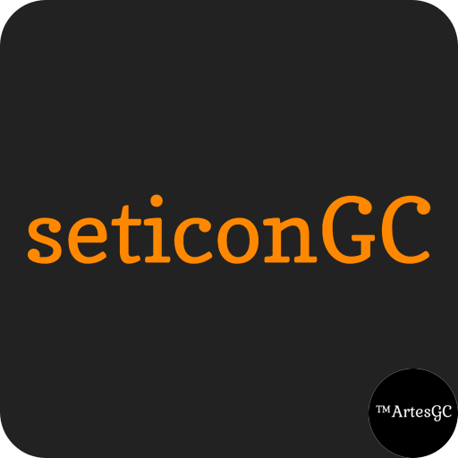
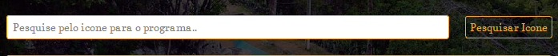

> `seticonGC` is an utilitary that uses the `GNU gcc` framework to compile and set an icon to your C/C++ program, without many stressfull steps, all you need to do is:

`- locate the script` \

`- locate the icon` \

`- hit the compile button and select where to save the program` \

---

&copy; 2022 Nurul-GC | &trade;ArtesGC, Inc.

